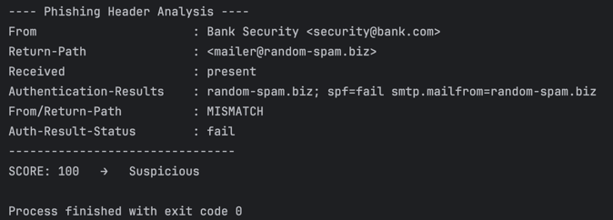

# Phish-header-analyser
================================================

Overview
========
Phish Header Analyser is a lightweight Java command-line tool that analyses raw .eml email files and flags potential
phishing attempts based on key header inconsistencies. It’s built from scratch using Jakarta Mail for MIME parsing and
applies custom heuristics to detect spoofing indicators such as:
- Domain mismatches between From and Return-Path
- Failed SPF/DKIM authentication results
- Missing or malformed Received headers

This project demonstrates skills in secure email processing, data parsing, object-oriented design, and rule-based
threat analysis, relevant for software engineering and cybersecurity internship roles.

Features
========
- Parses .eml files via Jakarta Mail API
- Extracts and displays essential headers (From, Return-Path, Received, Authentication-Results)
- Applies heuristic scoring (0–100) to classify emails as Safe or Suspicious
- Outputs structured results to the console with clear reasoning
- Includes sample phishing and legitimate emails for testing

How to Run (via IntelliJ IDE)
==============================
1. Clone the project from GitHub
2. Ensure dependencies are loaded (IntelliJ will automatically import dependencies from pom.xml (Jakarta Mail).)
3. Select the Main class to run:
   Navigate to:
   - src/main/java/dev/AliAhmedBG/phish/Main.java
   - Right-click and choose “Run 'Main.main()'”
4. Provide an email sample as argument:
   - Go to Run - Edit Configurations - Program Arguments
   - Add the path to a .eml file, for example: sample/spoofed.eml
5. Run the program then the console output will show the analysis results and phishing score.

EmailHeaderAnalyser.java
========================
Implements the core logic for parsing headers and applying phishing detection rules.
- Parses .eml data with Jakarta Mail
- Checks domain mismatches (From vs Return-Path)
- Evaluates SPF/DKIM authentication results
- Generates a numerical risk score and qualitative label

ScoringResult.java
==================
Immutable data class that encapsulates analysis results.
- Holds the overall score, risk label, and detailed findings
- Designed for clean separation between logic and presentation

Main.java
=========
Command-line interface that:
- Accepts a .eml file path as input
- Passes it to the analyser
- Prints formatted, human-readable results

Example output
==============

Learning outcome
================
Through this project, I strengthened my ability to:
- Build modular Java applications with clean architecture
- Use Jakarta Mail for parsing and analysing MIME messages
- Apply cybersecurity heuristics to real-world email metadata
- Develop and document a CLI security tool in a professional IDE environment

Future improvements
===================
1. Add GUI for drag-and-drop .eml analysis
2. Visualize header flow as a directed graph
3. Integrate DMARC and reverse DNS verification
4. Link with live threat intelligence APIs